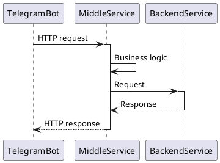
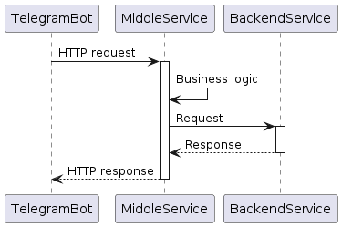

# Telegram-бот приложения Мини-банк

Telegram-бот "Мини-банка" - это фронтенд-часть приложения разрабатываемого в рамках программы [GPB IT Factory Backend 2024](https://gpb.fut.ru/itfactory/backend).
Бот инициирует запросы пользователей в Middle-слой, где происходит их дальнейшая обработка.

## Содержание

1. [Как использовать](#как-использовать)
2. [Архитектура системы](#архитектура-системы)
3. [Интеграции](#интеграции)

### Как использовать

- `/start` - точка входа в приложение, запускает бота
- `/help` - общая информация и описание основных функций
- `/stop` - остановка бота

### Архитектура системы

### Интеграции

- [Middle Service]() // TBD
- [Backend Service]() // TBD
