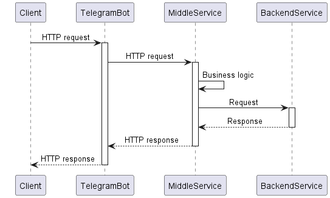
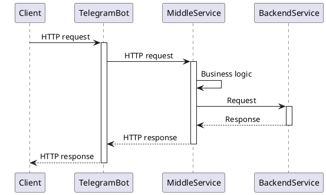

# Telegram-бот приложения Мини-банк

[](https://github.com/gpb-it-factory/gladskoy-telegram-bot/actions/workflows/gradle-ci.yml)
[](https://github.com/gpb-it-factory/gladskoy-telegram-bot/actions/workflows/gradle-ci.yml)
[](https://github.com/gpb-it-factory/gladskoy-telegram-bot/actions/workflows/gradle-ci.yml)

Telegram-бот "Мини-банка" - это фронтенд-часть приложения разрабатываемого в рамках программы [GPB IT Factory Backend 2024](https://gpb.fut.ru/itfactory/backend).
Бот инициирует запросы пользователей в Middle-слой, где происходит их дальнейшая обработка.


## Содержание

1. [Локальный запуск](#локальный-запуск)
2. [Как использовать](#как-использовать)
3. [Демо-видео работы приложения](#демо-видео-работы-приложения)
4. [Архитектура системы](#архитектура-системы)
5. [Интеграции](#интеграции)


### Локальный запуск

1. Получить API-токен с помощью Telegram-бота [@BotFather](https://t.me/botfather) (подробно данный процесс описан в 
[документации](https://core.telegram.org/bots/tutorial#obtain-your-bot-token))
2. Клонировать репозиторий
    ```bash
    git clone git@github.com:gpb-it-factory/gladskoy-telegram-bot.git
    ```
3. Перейти в директорию с проектом
   ```bash
   cd gladskoy-telegram-bot
   ```
4. Запустить приложение (`telegram_bot_name` будет создано при получении API-токена)
    ```bash
    BOT_NAME={telegram_bot_name} \
    BOT_TOKEN={telegram_bot_token} \
    ./gradlew bootRun
    ```
5. Найти в Telegram бота по имени `@{telegram_bot_name}` (пример `@GpbITFactoryGladskoyTelegramBot`)


### Как использовать

- `/start` - точка входа в приложение, запускает бота
- `/register` - первичное оформление пользователя
- `/createaccount` - открытие счёта в Мини-банке, в данный момент у клиента может быть только один счёт


### Демо-видео работы приложения

https://github.com/gpb-it-factory/gladskoy-telegram-bot/assets/13638247/e92e2eaa-30e2-4643-9e6a-fd8ac298e3e2


### Архитектура системы



<details>


</details>


### Интеграции

- [Middle Service](https://github.com/gpb-it-factory/gladskoy-middle-service)
- [Backend Service]() // TBD
